# `crates/ggen-config/src/config_lib/schema.rs`

Source SHA-256: `6339f4aa7681b58974ef08c7f72a0a42c15d0c9934399cdbc3a635cdd4cf4774`

```mermaid
classDiagram
    class struct_GgenConfig {
      <<struct>>
      +"project: ProjectConfig"
      +"ai: Option~AiConfig~"
      +"templates: Option~TemplatesConfig~"
      +"rdf: Option~RdfConfig~"
      +"sparql: Option~SparqlConfig~"
      +"lifecycle: Option~LifecycleConfig~"
      +"security: Option~SecurityConfig~"
      +"performance: Option~PerformanceConfig~"
      +"logging: Option~LoggingConfig~"
      +"telemetry: Option~TelemetryConfig~"
      +"features: Option~HashMap~String"
      +"env: Option~HashMap~String"
      +"build: Option~BuildConfig~"
      +"test: Option~TestConfig~"
      +"package: Option~PackageMetadata~"
      +"mcp: Option~McpConfig~"
      +"a2a: Option~A2AConfig~"
    }
    class struct_ProjectConfig {
      <<struct>>
      +"name: String"
      +"version: String"
      +"description: Option~String~"
      +"authors: Option~Vec~String~~"
      +"license: Option~String~"
      +"repository: Option~String~"
    }
    class struct_AiConfig {
      <<struct>>
      +"provider: String"
      +"model: String"
      +"temperature: f32"
      +"max_tokens: u32"
      +"timeout: u32"
      +"prompts: Option~AiPrompts~"
      +"validation: Option~AiValidation~"
    }
    class struct_AiPrompts {
      <<struct>>
      +"system: Option~String~"
      +"user_prefix: Option~String~"
    }
    class struct_AiValidation {
      <<struct>>
      +"enabled: bool"
      +"quality_threshold: f32"
      +"max_iterations: u32"
    }
    class struct_TemplatesConfig {
      <<struct>>
      +"directory: Option~String~"
      +"output_directory: Option~String~"
      +"backup_enabled: bool"
      +"idempotent: bool"
    }
    class struct_RdfConfig {
      <<struct>>
      +"base_uri: Option~String~"
      +"base_iri: Option~String~"
      +"prefixes: Option~HashMap~String"
      +"default_format: Option~String~"
      +"cache_queries: bool"
    }
    class struct_SparqlConfig {
      <<struct>>
      +"timeout: u32"
      +"max_results: u32"
      +"cache_enabled: bool"
    }
    class struct_LifecycleConfig {
      <<struct>>
      +"enabled: bool"
      +"config_file: Option~String~"
      +"cache_directory: Option~String~"
      +"state_file: Option~String~"
      +"phases: Option~HashMap~String"
    }
    class struct_SecurityConfig {
      <<struct>>
      +"path_traversal_protection: bool"
      +"shell_injection_protection: bool"
      +"template_sandboxing: bool"
      +"validate_paths: bool"
      +"require_confirmation: bool"
      +"audit_operations: bool"
      +"backup_before_write: bool"
    }
    class struct_PerformanceConfig {
      <<struct>>
      +"parallel_execution: bool"
      +"max_workers: u32"
      +"cache_size: Option~String~"
      +"enable_profiling: bool"
      +"memory_limit_mb: Option~u32~"
    }
    class struct_LoggingConfig {
      <<struct>>
      +"level: String"
      +"format: String"
      +"file: Option~String~"
      +"rotation: Option~String~"
    }
    class struct_TelemetryConfig {
      <<struct>>
      +"endpoint: String"
      +"service_name: String"
      +"console_output: bool"
    }
    class struct_BuildConfig {
      <<struct>>
      +"target: Option~String~"
      +"features: Option~Vec~String~~"
      +"profile: Option~String~"
      +"parallel_jobs: Option~u32~"
    }
    class struct_TestConfig {
      <<struct>>
      +"framework: Option~String~"
      +"parallel: bool"
      +"timeout_seconds: Option~u32~"
      +"coverage_enabled: bool"
      +"coverage_threshold: Option~u32~"
    }
    class struct_PackageMetadata {
      <<struct>>
      +"name: String"
      +"version: String"
      +"description: Option~String~"
      +"authors: Option~Vec~String~~"
      +"license: Option~String~"
      +"repository: Option~String~"
      +"keywords: Option~Vec~String~~"
      +"categories: Option~Vec~String~~"
      +"metadata: Option~HashMap~String"
    }
    class struct_McpConfig {
      <<struct>>
      +"name: Option~String~"
      +"version: Option~String~"
      +"tool_timeout_ms: u64"
      +"max_concurrent_requests: usize"
      +"transport: Option~McpTransportConfig~"
      +"tools: Option~McpToolsConfig~"
      +"zai: Option~McpZaiConfig~"
      +"enabled: bool"
      +"discovery: Option~McpDiscoveryConfig~"
    }
    class struct_McpTransportConfig {
      <<struct>>
      +"transport_type: String"
      +"port: Option~u16~"
      +"host: String"
      +"tls: Option~McpTlsConfig~"
      +"request_timeout_seconds: u64"
    }
    class struct_McpTlsConfig {
      <<struct>>
      +"enabled: bool"
      +"cert_path: Option~String~"
      +"key_path: Option~String~"
      +"ca_path: Option~String~"
    }
    class struct_McpToolsConfig {
      <<struct>>
      +"discovery_path: Option~String~"
      +"require_registration: bool"
      +"validate_signatures: bool"
      +"allowed_prefixes: Option~Vec~String~~"
    }
    class struct_McpZaiConfig {
      <<struct>>
      +"enabled: bool"
      +"provider_url: Option~String~"
      +"model: Option~String~"
      +"cache_enabled: bool"
      +"cache_ttl_seconds: u64"
    }
    class struct_McpDiscoveryConfig {
      <<struct>>
      +"enabled: bool"
      +"method: String"
      +"registry_url: Option~String~"
      +"cache_ttl_seconds: u64"
    }
    class struct_A2AConfig {
      <<struct>>
      +"agent_id: Option~String~"
      +"agent_name: Option~String~"
      +"agent_type: Option~String~"
      +"transport: Option~A2ATransportConfig~"
      +"messaging: Option~A2AMessagingConfig~"
      +"orchestration: Option~A2AOrchestrationConfig~"
      +"capabilities: Option~Vec~String~~"
      +"enabled: bool"
    }
    class struct_A2ATransportConfig {
      <<struct>>
      +"transport_type: String"
      +"bind_address: Option~String~"
      +"port: Option~u16~"
      +"timeout_ms: u64"
      +"max_connections: Option~usize~"
      +"retry: Option~A2ARetryConfig~"
    }
    class struct_A2ARetryConfig {
      <<struct>>
      +"max_attempts: u32"
      +"initial_delay_ms: u64"
      +"max_delay_ms: u64"
      +"exponential_backoff: bool"
    }
    class struct_A2AMessagingConfig {
      <<struct>>
      +"queue_size: usize"
      +"message_ttl_seconds: u64"
      +"persistence_enabled: bool"
      +"persistence_path: Option~String~"
      +"signing_enabled: bool"
      +"signature_algorithm: Option~String~"
    }
    class struct_A2AOrchestrationConfig {
      <<struct>>
      +"mode: String"
      +"coordinator_address: Option~String~"
      +"heartbeat_interval_seconds: u64"
      +"agent_timeout_seconds: u64"
      +"consensus_enabled: bool"
      +"consensus_algorithm: Option~String~"
    }
    class fn_default_max_workers {
      <<fn>>
    }
    class fn_default_log_level {
      <<fn>>
    }
    class fn_default_log_format {
      <<fn>>
    }
    class fn_num_cpus {
      <<fn>>
    }
    class fn_default_mcp_transport_type {
      <<fn>>
    }
    class fn_default_mcp_host {
      <<fn>>
    }
    class fn_default_mcp_enabled {
      <<fn>>
    }
    class fn_default_mcp_discovery_method {
      <<fn>>
    }
    class fn_default_a2a_enabled {
      <<fn>>
    }
    class fn_default_a2a_transport_type {
      <<fn>>
    }
    class fn_default_a2a_orchestration_mode {
      <<fn>>
    }
    class fn_default_telemetry_endpoint {
      <<fn>>
    }
    class fn_default_telemetry_service_name {
      <<fn>>
    }
    class fn_default_telemetry_console_output {
      <<fn>>
    }
    class mod_tests {
      <<mod>>
    }
    note "Default for GgenConfig"
    note "Validate for A2AConfig"
    note "Validate for A2AMessagingConfig"
    note "Validate for A2AOrchestrationConfig"
    note "Validate for A2ARetryConfig"
    note "Validate for A2ATransportConfig"
    note "Validate for AiConfig"
    note "Validate for AiPrompts"
    note "Validate for AiValidation"
    note "Validate for BuildConfig"
    note "Validate for GgenConfig"
    note "Validate for LifecycleConfig"
    note "Validate for LoggingConfig"
    note "Validate for McpConfig"
    note "Validate for McpDiscoveryConfig"
    note "Validate for McpTlsConfig"
    note "Validate for McpToolsConfig"
    note "Validate for McpTransportConfig"
    note "Validate for McpZaiConfig"
    note "Validate for PackageMetadata"
    note "Validate for PerformanceConfig"
    note "Validate for ProjectConfig"
    note "Validate for RdfConfig"
    note "Validate for SecurityConfig"
    note "Validate for SparqlConfig"
    note "Validate for TelemetryConfig"
    note "Validate for TemplatesConfig"
    note "Validate for TestConfig"
```

## Dependencies

- `serde::{Deserialize, Serialize}`
- `star_toml::Validate`
- `star_toml::{Validate, Validator}`
- `std::collections::HashMap`
- `super::*`

## Standing

- Structural parse: `ALIVE`
- Runtime behavior: `UNKNOWN`
