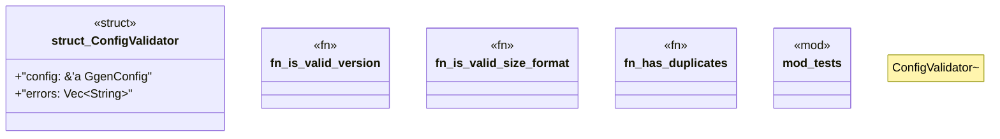

# `crates/ggen-config/src/config_lib/validator.rs`

Source SHA-256: `2455f0aa4e0bcf8036d9fb7c682164e9ea88057b895d252f27acfb71292cd72b`

## Dependencies

- `crate::config_lib::{ConfigError, GgenConfig, Result}`
- `crate::config_lib::{ConfigLoader, ProjectConfig}`
- `star_toml::Validate`
- `std::collections::HashSet`
- `super::*`

## Standing

- Structural parse: `ALIVE`
- Runtime behavior: `UNKNOWN`
