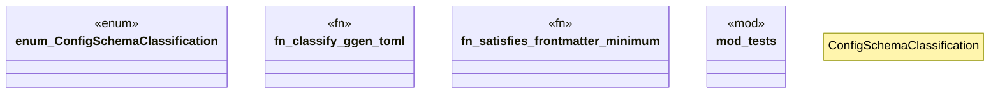

# `crates/ggen-config/src/config_schema.rs`

Source SHA-256: `22897b0e10385a1cb07b3577e43d7bf2fab8804a51dddc72f318ea090c7ed0e6`

## Dependencies

- `crate::manifest::ManifestParser`
- `std::collections::BTreeSet`
- `super::*`
- `toml::Value`

## Standing

- Structural parse: `ALIVE`
- Runtime behavior: `UNKNOWN`
