# `crates/ggen-config/src/domain/error.rs`

Source SHA-256: `9df88f6fc0cb4a89e8fac9065b252b59fde5b24224dd448e11212e70e690f2c6`

```mermaid
classDiagram
    class enum_A2aError {
      <<enum>>
    }
    class enum_McpError {
      <<enum>>
    }
    class enum_AgentError {
      <<enum>>
    }
    class fn_a2a_connection_error {
      <<fn>>
    }
    class fn_a2a_auth_error {
      <<fn>>
    }
    class fn_mcp_server_error {
      <<fn>>
    }
    class fn_agent_startup_error {
      <<fn>>
    }
    class mod_tests {
      <<mod>>
    }
    note "From~A2aError~ for ConfigError"
    note "From~AgentError~ for ConfigError"
    note "From~McpError~ for ConfigError"
```

## Dependencies

- `crate::config_lib::ConfigError`
- `super::*`
- `thiserror::Error`

## Standing

- Structural parse: `ALIVE`
- Runtime behavior: `UNKNOWN`
