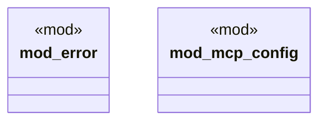

# `crates/ggen-config/src/domain/mod.rs`

Source SHA-256: `5b1dd38c7d55664d6f82f9e302326966251b73840e4d29822991e54669fd19b8`

## Dependencies

- None observed.

## Standing

- Structural parse: `ALIVE`
- Runtime behavior: `UNKNOWN`
