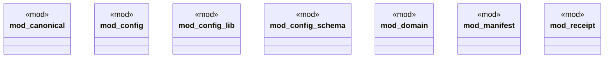

# `crates/ggen-config/src/lib.rs`

Source SHA-256: `cb179b0a909e2054272018aa03c7ca4f2843285158f35b2dda765e9925571176`

## Dependencies

- `config_lib::{ A2AConfig, A2AMessagingConfig, A2AOrchestrationConfig, A2ARetryConfig, A2ATransportConfig, AiConfig, ConfigError, ConfigLoader, ConfigValidator, GgenConfig, McpConfig, McpDiscoveryConfig, McpTlsConfig, McpToolsConfig, McpTransportConfig, McpZaiConfig, ProjectConfig, Result, TelemetryConfig, TemplatesConfig, }`
- `config_schema::{ classify_ggen_toml, ConfigSchemaClassification, CONFIG_PARSE_FAILED, CONFIG_SCHEMA_AMBIGUOUS, CONFIG_SCHEMA_MIGRATION_REQUIRED, CONFIG_SCHEMA_SUPPORTED, CONFIG_SCHEMA_UNSUPPORTED, }`
- `receipt::{ chain, create_chained_receipt, envelope, error, generate_keypair, hash_data, payload_hash, receipt_impl, EnvelopeChain, EnvelopeChainLink, EnvelopeSignature, PayloadRef, Producer, Receipt, ReceiptChain, ReceiptEnvelope, ReceiptError, ENVELOPE_SCHEMA, HASH_PREFIX, SIGNATURE_ALGORITHM, }`

## Standing

- Structural parse: `ALIVE`
- Runtime behavior: `UNKNOWN`
