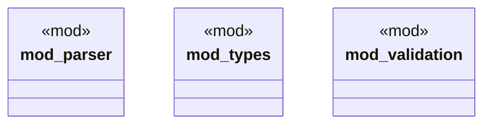

# `crates/ggen-config/src/manifest/mod.rs`

Source SHA-256: `94e99edd602e5402898b82619e1f32fa70d0be5fe3ebf8b3118aa5e4da1eede8`

## Dependencies

- `parser::ManifestParser`
- `types::{ GenerationConfig, GenerationMode, GenerationRule, GgenManifest, InferenceConfig, InferenceRule, Law, OntologyConfig, PackRef, PackSection, PackageToml, ProjectConfig, QuerySource, TemplateSource, ValidationConfig, ValidationRule, ValidationSeverity, }`
- `validation::{query_contains_values, query_has_order_by, ManifestValidator}`

## Standing

- Structural parse: `ALIVE`
- Runtime behavior: `UNKNOWN`
