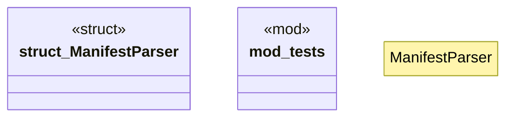

# `crates/ggen-config/src/manifest/parser.rs`

Source SHA-256: `3cecc48e22c0675d1cddb4371c786d63b52d0a36d648f459f9aeaee36a85d5df`

## Dependencies

- `crate::manifest::types::GgenManifest`
- `crate::manifest::validation::ManifestValidator`
- `crate::{ConfigError, Result}`
- `std::path::Path`
- `super::*`

## Standing

- Structural parse: `ALIVE`
- Runtime behavior: `UNKNOWN`
