# `crates/ggen-config/src/manifest/types.rs`

Source SHA-256: `5373783e5ababce7e608c5e37838040ccd9438d46d8e5081459550044af08629`

```mermaid
classDiagram
    class fn_default_sparql_timeout {
      <<fn>>
    }
    class fn_default_reasoning_timeout {
      <<fn>>
    }
    class fn_default_output_dir {
      <<fn>>
    }
    class struct_PackRef {
      <<struct>>
      +"name: String"
      +"registry: String"
      +"path: Option~PathBuf~"
      +"version: Option~String~"
    }
    class fn_default_registry {
      <<fn>>
    }
    class struct_PackageToml {
      <<struct>>
      +"pack: Option~PackSection~"
      +"outputs: std::collections::HashMap~String"
    }
    class struct_PackSection {
      <<struct>>
      +"outputs: std::collections::HashMap~String"
    }
    class struct_GgenManifest {
      <<struct>>
      +"project: ProjectConfig"
      +"ontology: OntologyConfig"
      +"inference: InferenceConfig"
      +"generation: GenerationConfig"
      +"validation: ValidationConfig"
      +"packs: Vec~PackRef~"
      +"law: Law"
      +"sync: Option~toml::Value~"
      +"output: Option~toml::Value~"
      +"rdf: Option~crate::config_lib::RdfConfig~"
      +"templates: Option~crate::config_lib::TemplatesConfig~"
      +"ai: Option~crate::config_lib::AiConfig~"
      +"sparql: Option~crate::config_lib::SparqlConfig~"
      +"lifecycle: Option~crate::config_lib::LifecycleConfig~"
      +"security: Option~crate::config_lib::SecurityConfig~"
      +"performance: Option~crate::config_lib::PerformanceConfig~"
      +"logging: Option~crate::config_lib::LoggingConfig~"
      +"telemetry: Option~crate::config_lib::TelemetryConfig~"
      +"features: Option~std::collections::HashMap~String"
      +"env: Option~std::collections::HashMap~String"
      +"build: Option~crate::config_lib::BuildConfig~"
      +"test: Option~crate::config_lib::TestConfig~"
      +"package: Option~crate::config_lib::PackageMetadata~"
      +"mcp: Option~crate::config_lib::McpConfig~"
      +"a2a: Option~crate::config_lib::A2AConfig~"
    }
    class struct_Law {
      <<struct>>
      +"rules: Vec~PathBuf~"
    }
    class struct_ProjectConfig {
      <<struct>>
      +"name: String"
      +"version: String"
      +"description: Option~String~"
      +"authors: Option~Vec~String~~"
      +"license: Option~String~"
      +"repository: Option~String~"
    }
    class struct_OntologyConfig {
      <<struct>>
      +"source: PathBuf"
      +"imports: Vec~PathBuf~"
      +"base_iri: Option~String~"
      +"prefixes: BTreeMap~String"
      +"standard_only: Option~bool~"
    }
    class struct_InferenceConfig {
      <<struct>>
      +"rules: Vec~InferenceRule~"
      +"max_reasoning_timeout_ms: u64"
    }
    class struct_InferenceRule {
      <<struct>>
      +"name: String"
      +"description: Option~String~"
      +"construct: String"
      +"order: i32"
      +"when: Option~String~"
    }
    class struct_GenerationConfig {
      <<struct>>
      +"rules: Vec~GenerationRule~"
      +"max_sparql_timeout_ms: u64"
      +"require_audit_trail: bool"
      +"determinism_salt: Option~String~"
      +"output_dir: PathBuf"
      +"enable_llm: bool"
      +"llm_provider: Option~String~"
      +"llm_model: Option~String~"
    }
    class struct_GenerationRule {
      <<struct>>
      +"name: String"
      +"query: QuerySource"
      +"template: TemplateSource"
      +"output_file: String"
      +"skip_empty: bool"
      +"mode: GenerationMode"
      +"when: Option~String~"
    }
    class enum_QuerySource {
      <<enum>>
    }
    class enum_TemplateSource {
      <<enum>>
    }
    class enum_GenerationMode {
      <<enum>>
    }
    class struct_ValidationConfig {
      <<struct>>
      +"shacl: Vec~PathBuf~"
      +"gates: Vec~PathBuf~"
      +"validate_syntax: bool"
      +"no_unsafe: bool"
      +"strict_mode: bool"
      +"rules: Vec~ValidationRule~"
    }
    class struct_ValidationRule {
      <<struct>>
      +"name: String"
      +"description: String"
      +"ask: String"
      +"severity: ValidationSeverity"
    }
    class enum_ValidationSeverity {
      <<enum>>
    }
    class mod_tests {
      <<mod>>
    }
    note "Default for GenerationConfig"
    note "Default for GgenManifest"
    note "Default for OntologyConfig"
    note "Default for ProjectConfig"
    note "PackageToml"
```

## Dependencies

- `schemars::JsonSchema`
- `serde::{Deserialize, Serialize}`
- `std::collections::BTreeMap`
- `std::path::PathBuf`
- `super::*`

## Standing

- Structural parse: `ALIVE`
- Runtime behavior: `UNKNOWN`
