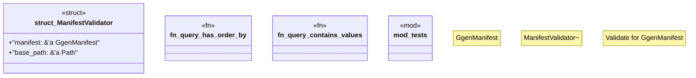

# `crates/ggen-config/src/manifest/validation.rs`

Source SHA-256: `25cee211fe07366f98c84a699b058fb7d640569f7c12b862da8313e1a3a3de7c`

## Dependencies

- `crate::manifest::ManifestParser`
- `crate::manifest::types::{GgenManifest, QuerySource, TemplateSource}`
- `crate::{ConfigError, Result}`
- `star_toml::{Validate, Validator}`
- `std::path::Path`
- `super::*`

## Standing

- Structural parse: `ALIVE`
- Runtime behavior: `UNKNOWN`
