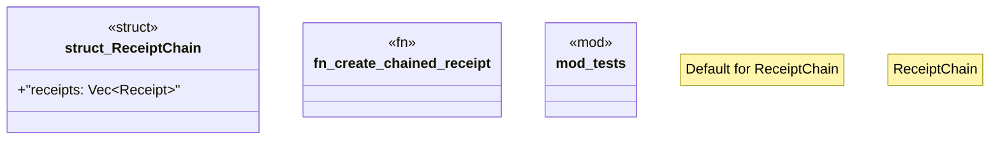

# `crates/ggen-config/src/receipt/chain.rs`

Source SHA-256: `c30f76d9fa3cde18e1859a0dfe44ce83cab1791871f192be89b4d90d3cff0b12`

## Dependencies

- `crate::Receipt`
- `crate::error::{ReceiptError, Result}`
- `crate::generate_keypair`
- `ed25519_dalek::VerifyingKey`
- `serde::{Deserialize, Serialize}`
- `super::*`

## Standing

- Structural parse: `ALIVE`
- Runtime behavior: `UNKNOWN`
