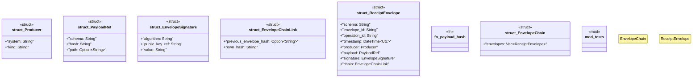

# `crates/ggen-config/src/receipt/envelope.rs`

Source SHA-256: `943822986fb831e02df9075a49a4cb713358aab0fb5f9e5bcfbfa379d4db6e1b`

## Dependencies

- `chrono::{DateTime, Utc}`
- `crate::error::{ReceiptError, Result}`
- `crate::generate_keypair`
- `ed25519_dalek::{Signature, Signer, SigningKey, Verifier, VerifyingKey}`
- `serde::{Deserialize, Serialize}`
- `super::*`

## Standing

- Structural parse: `ALIVE`
- Runtime behavior: `UNKNOWN`
