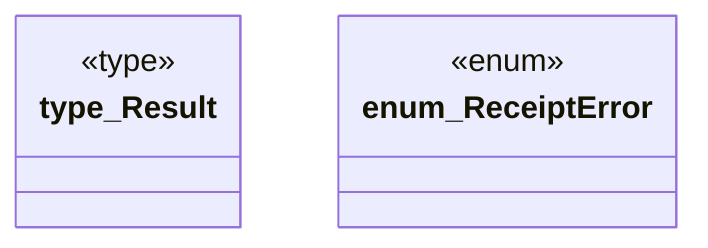

# `crates/ggen-config/src/receipt/error.rs`

Source SHA-256: `cb406dee024336429e8528475ee36f1b11fe124485709419e7bea3fd33b7f2cc`

## Dependencies

- `thiserror::Error`

## Standing

- Structural parse: `ALIVE`
- Runtime behavior: `UNKNOWN`
