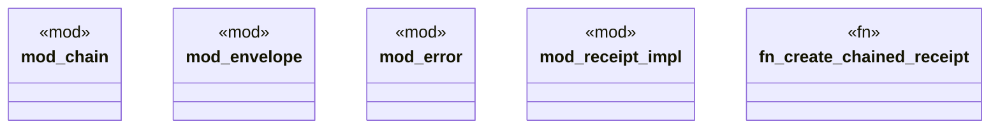

# `crates/ggen-config/src/receipt/mod.rs`

Source SHA-256: `a3e9f832d537a471ce306159195bf671c3d43db0af836d861296d45b3ea988bd`

## Dependencies

- `chain::ReceiptChain`
- `envelope::{ payload_hash, EnvelopeChain, EnvelopeChainLink, EnvelopeSignature, PayloadRef, Producer, ReceiptEnvelope, ENVELOPE_SCHEMA, HASH_PREFIX, SIGNATURE_ALGORITHM, }`
- `error::{ReceiptError, Result}`
- `self::receipt_impl::{generate_keypair, hash_data, Receipt}`

## Standing

- Structural parse: `ALIVE`
- Runtime behavior: `UNKNOWN`
