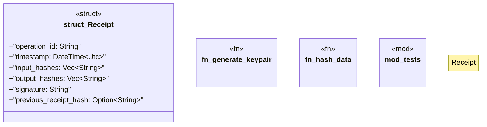

# `crates/ggen-config/src/receipt/receipt_impl.rs`

Source SHA-256: `ac1aea64ae33b6eeaa454c2bae558bea60f3735b100f6a5f8fa6500945aebe63`

## Dependencies

- `chrono::{DateTime, Utc}`
- `crate::error::{ReceiptError, Result}`
- `ed25519_dalek::{Signature, Signer, SigningKey, Verifier, VerifyingKey}`
- `rand::rngs::OsRng`
- `serde::{Deserialize, Serialize}`
- `sha2::{Digest, Sha256}`
- `super::*`

## Standing

- Structural parse: `ALIVE`
- Runtime behavior: `UNKNOWN`
