# `crates/ggen-config/tests/adversarial_tests.rs`

Source SHA-256: `43ab891bb87f6643d4a9e066020949565e46ea7c481e3732bef424ab2315e83c`

```mermaid
classDiagram
    class fn_test_minimal_and_empty_configs {
      <<fn>>
    }
    class fn_test_missing_optional_subconfigs {
      <<fn>>
    }
    class fn_test_extreme_values_ai {
      <<fn>>
    }
    class fn_test_extreme_values_mcp_and_a2a {
      <<fn>>
    }
    class fn_test_performance_workers_constraint {
      <<fn>>
    }
    class fn_test_parser_invalid_mixed_types {
      <<fn>>
    }
    class fn_test_additional_config_validation_gaps {
      <<fn>>
    }
    class fn_test_more_extreme_config_adversarial {
      <<fn>>
    }
    class fn_test_adversarial_stress_checks {
      <<fn>>
    }
    class fn_test_new_adversarial_vulnerabilities {
      <<fn>>
    }
```

## Dependencies

- `ggen_config::config::LockConfig`
- `ggen_config::config::OntologyConfig`
- `ggen_config::config::OntologyPackRef`
- `ggen_config::config::TargetConfig`
- `ggen_config::config_lib::ConfigValidator`
- `ggen_config::config_lib::{ A2AConfig, A2AOrchestrationConfig, A2ATransportConfig, AiConfig, AiValidation, ConfigLoader, GgenConfig, McpConfig, McpTransportConfig, PerformanceConfig, ProjectConfig, TemplatesConfig, }`
- `star_toml::Validate`

## Standing

- Structural parse: `ALIVE`
- Runtime behavior: `UNKNOWN`
