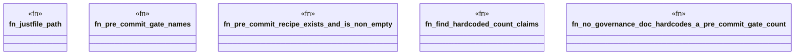

# `crates/ggen-config/tests/governance_precommit_gate_count_test.rs`

Source SHA-256: `0742dc9df9fbd52b296205c73f022bbfb2edc502678435b278edb52f449a333d`

## Dependencies

- `std::path::PathBuf`

## Standing

- Structural parse: `ALIVE`
- Runtime behavior: `UNKNOWN`
