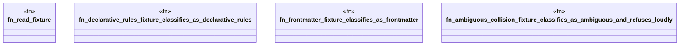

# `crates/ggen-config/tests/schema_dual_fixtures_test.rs`

Source SHA-256: `15a2485f9464b4446408632c760f7320a639006c79caebbfeb5cc1a8caac8bdc`

## Dependencies

- `ggen_config::ConfigSchemaClassification`

## Standing

- Structural parse: `ALIVE`
- Runtime behavior: `UNKNOWN`
