# `crates/ggen-config/tests/schema_parity_test.rs`

Source SHA-256: `18a1b3d7ed6603039a40556f3675d14ef06d21274b1a47f43acf42993735f3e0`

```mermaid
classDiagram
    class fn_ggen_manifest_source_path {
      <<fn>>
    }
    class fn_ggen_config_source_path {
      <<fn>>
    }
    class fn_struct_field_names {
      <<fn>>
    }
    class fn_read_both_schemas {
      <<fn>>
    }
    class fn_known_shared_table_names_exist_on_both_schemas {
      <<fn>>
    }
    class fn_shared_field_intersection_matches_frozen_baseline_exactly {
      <<fn>>
    }
    class fn_both_schema_structs_are_still_named_and_parseable {
      <<fn>>
    }
```

## Dependencies

- `std::collections::BTreeSet`
- `std::path::PathBuf`

## Standing

- Structural parse: `ALIVE`
- Runtime behavior: `UNKNOWN`
