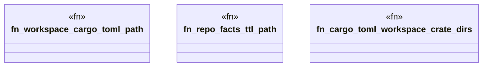

# `crates/ggen-config/tests/system_crate_map_parity_test.rs`

Source SHA-256: `e77a621620dbadb757bb7bd07634cf1a8eefecb12409dd667a6349c1347fd192`

## Dependencies

- `std::collections::BTreeSet`
- `std::path::PathBuf`

## Standing

- Structural parse: `ALIVE`
- Runtime behavior: `UNKNOWN`
