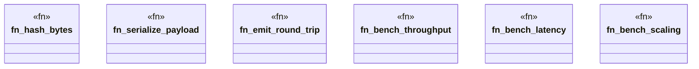

# `crates/ggen-engine/benches/bench_main.rs`

Source SHA-256: `9d6e6d09a1029832ba9e07b8912f1fda3d8aff652e8ea7b748de99e8279755f5`

## Dependencies

- `criterion::{criterion_group, criterion_main, BenchmarkId, Criterion, Throughput}`
- `std::hint::black_box`

## Standing

- Structural parse: `ALIVE`
- Runtime behavior: `UNKNOWN`
