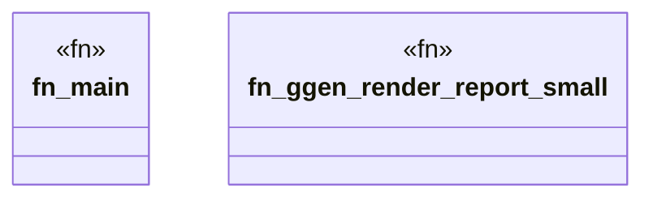

# `crates/ggen-engine/benches/blue_river_dam.rs`

Source SHA-256: `36cf07ee60e70bb2f67f6012bea8859576ddd5ce1c1d97e888a33ff70a1a4c28`

## Dependencies

- `ggen_engine::graph::{GraphEngine, GraphLawStore}`
- `ggen_engine::template::build_tera`
- `std::hint::black_box`
- `std::sync::Arc`

## Standing

- Structural parse: `ALIVE`
- Runtime behavior: `UNKNOWN`
