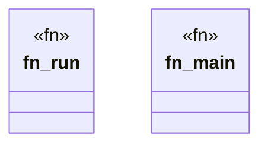

# `crates/ggen-engine/src/bin/dod.rs`

Source SHA-256: `2291824416ceb147a887e92fa99920017d7198e9bd6c6f1c74d7812901f3f8c9`

## Dependencies

- `std::process::{exit, Command}`

## Standing

- Structural parse: `ALIVE`
- Runtime behavior: `UNKNOWN`
