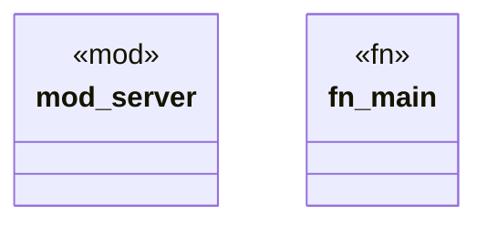

# `crates/ggen-engine/src/bin/mcp_server.rs`

Source SHA-256: `22312974eb5bc5ef3a22e07a04416552d13a67f86a465a199b848fc4bf4fcd48`

## Dependencies

- `rmcp::{ handler::server::{router::tool::ToolRouter, wrapper::Parameters}, model::CallToolResult, tool, tool_handler, tool_router, ServerHandler, }`
- `rmcp::{transport::stdio, ServiceExt as _}`
- `schemars::JsonSchema`
- `serde::Deserialize`

## Standing

- Structural parse: `ALIVE`
- Runtime behavior: `UNKNOWN`
