# `crates/ggen-engine/src/config.rs`

Source SHA-256: `4a4e2abda7b0cb0e8c573c020f80adfb548e72046e785e8d452eea2ff48c8005`

```mermaid
classDiagram
    class struct_GgenConfig {
      <<struct>>
      +"project: Project"
      +"ontology: Ontology"
      +"packs: BTreeMap~String"
      +"templates: Templates"
      +"law: Law"
    }
    class struct_Law {
      <<struct>>
      +"rules: Vec~PathBuf~"
      +"shapes: Vec~PathBuf~"
      +"gates: Vec~PathBuf~"
      +"reflexive: bool"
    }
    class struct_Project {
      <<struct>>
      +"name: String"
    }
    class struct_Ontology {
      <<struct>>
      +"source: PathBuf"
      +"prefixes: BTreeMap~String"
    }
    class enum_PackRef {
      <<enum>>
    }
    class fn_default_true {
      <<fn>>
    }
    class struct_Templates {
      <<struct>>
      +"dir: PathBuf"
      +"aggregate_modules: bool"
    }
    note "GgenConfig"
    note "Validate for GgenConfig"
    note "Validate for Law"
    note "Validate for Ontology"
    note "Validate for PackRef"
    note "Validate for Project"
    note "Validate for Templates"
```

## Dependencies

- `crate::error::{AppError, Result}`
- `schemars::JsonSchema`
- `serde::{Deserialize, Serialize}`
- `star_toml::{Validate, Validator}`
- `std::{ collections::BTreeMap, path::{Path, PathBuf}, }`

## Standing

- Structural parse: `ALIVE`
- Runtime behavior: `UNKNOWN`
