# `crates/ggen-engine/src/error.rs`

Source SHA-256: `f2224688cf7d2c8a5446b1f0f5a7a1ea9542f1a00fbf7dead36de58c2d45ca69`

```mermaid
classDiagram
    class enum_AppError {
      <<enum>>
    }
    class type_Result {
      <<type>>
    }
    class enum_TemplateFailureCause {
      <<enum>>
    }
    class trait_CliValidator {
      <<trait>>
      +"validate_run_args(&self, parallel: bool, jobs: usize) -~ Result~()~"
    }
    class struct_DefaultCliValidator {
      <<struct>>
    }
    class struct_ValidationChain {
      <<struct>>
      +"errors: Vec~String~"
    }
    class mod_validation_chain_tests {
      <<mod>>
    }
    note "AppError"
    note "CliValidator for DefaultCliValidator"
    note "Default for DefaultCliValidator"
    note "Default for ValidationChain"
    note "TemplateFailureCause"
    note "ValidationChain"
```

## Dependencies

- `once_cell::sync::Lazy`
- `super::*`
- `thiserror::Error`

## Standing

- Structural parse: `ALIVE`
- Runtime behavior: `UNKNOWN`
