# `crates/ggen-engine/src/generation_rules.rs`

Source SHA-256: `c215e013d4370fd2e5a62908862fb9a81f5f7071ed9b19dd1481a6334206b5f1`

```mermaid
classDiagram
    class fn_run {
      <<fn>>
    }
    class struct_PendingGenWrite {
      <<struct>>
      +"to: String"
      +"body: String"
      +"mode: GenerationMode"
    }
    class fn_resolve_query_source {
      <<fn>>
    }
    class fn_resolve_template_source {
      <<fn>>
    }
    class fn_template_source_descriptor {
      <<fn>>
    }
    class fn_detect_file_tree_meta_spec {
      <<fn>>
    }
    class fn_render_output_file {
      <<fn>>
    }
    class fn_render_template {
      <<fn>>
    }
    class fn_validate_rendered_body {
      <<fn>>
    }
    class enum_GenWriteOutcome {
      <<enum>>
    }
    class fn_decide_and_maybe_apply {
      <<fn>>
    }
    class mod_merge {
      <<mod>>
    }
```

## Dependencies

- `crate::error::{AppError, Result}`
- `crate::{ error::{AppError, Result, TemplateFailureCause}, graph::{EngineQueryResults, GraphEngine, TurtleDocument}, sync::{ hash_file_or_missing, hex32, new_graph_engine, read_ontology_file, rel_display, write_receipt, SyncOptions, SyncReport, }, template::{ build_tera, classify_tera_render_error, solutions_to_values, tera_error_full_chain, tera_error_location, }, }`
- `ggen_config::manifest::{ GenerationMode, GenerationRule, GgenManifest, QuerySource, TemplateSource, }`
- `std::{ collections::BTreeMap, path::{Path, PathBuf}, sync::Arc, time::Instant, }`
- `super::*`
- `tera::Value`

## Standing

- Structural parse: `ALIVE`
- Runtime behavior: `UNKNOWN`
