# `crates/ggen-engine/src/graph.rs`

Source SHA-256: `f1ef20afb885344b740c5246842c96c1d19de3ec92a4d5aa0025b30b250faf4c`

```mermaid
classDiagram
    class mod_ontology_batch {
      <<mod>>
    }
    class struct_DeterministicGraph {
      <<struct>>
      +"store: Store"
    }
    class fn_query_has_graph_clause {
      <<fn>>
    }
    class fn_graph_pattern_has_graph_clause {
      <<fn>>
    }
    class fn_expression_has_graph_clause {
      <<fn>>
    }
    class fn_aggregate_expression_has_graph_clause {
      <<fn>>
    }
    class fn_looks_like_sparql_update {
      <<fn>>
    }
    class type_EngineRow {
      <<type>>
    }
    class enum_EngineValue {
      <<enum>>
    }
    class struct_EngineTriple {
      <<struct>>
      +"subject: String"
      +"predicate: String"
      +"object_value: String"
      +"ntriples: String"
    }
    class enum_EngineQueryResults {
      <<enum>>
    }
    class struct_ShaclOutcome {
      <<struct>>
      +"conforms: bool"
      +"violations: Vec~String~"
    }
    class struct_MaterializeOutcome {
      <<struct>>
      +"derived: Vec~String~"
      +"rules_loaded: usize"
    }
    class trait_GraphEngine {
      <<trait>>
      +"insert_turtle(&self, ttl: &str) -~ Result~usize~"
      +"insert_turtle_documents(
        &self, documents: &[TurtleDocument~'_~],
    ) -~ Result~OntologyBatchReceipt~"
      +"query(&self, sparql: &str) -~ Result~EngineQueryResults~"
      +"canonical_quads(&self) -~ Result~Vec~String~~"
      +"state_hash(&self) -~ Result~[u8"
      +"load_rules(&self, rules: &str) -~ Result~usize~"
      +"load_hook_pack(&self, hook_ttl: &str) -~ Result~()~"
      +"materialize(&self) -~ Result~MaterializeOutcome~"
      +"validate_shacl(&self, shapes_turtle: &str) -~ Result~ShaclOutcome~"
      +"validate_shex(
        &self, schema_shexc: &str, shape_map: &[(String, String)"
      +"check_denials(&self) -~ Result~Vec~String~~"
    }
    class fn_term_value {
      <<fn>>
    }
    class fn_term_to_engine_value {
      <<fn>>
    }
    class struct_GraphLawStore {
      <<struct>>
      +"mirror: DeterministicGraph"
      +"law: std::sync::Mutex~LawState~"
    }
    class struct_LawState {
      <<struct>>
      +"rules_src: Vec~String~"
      +"hooks_src: Vec~String~"
      +"store: Option~praxis_graphlaw::TripleStore~"
      +"rules_loaded: usize"
    }
    class struct_Delta {
      <<struct>>
      +"additions: Vec~String~"
      +"deletions: Vec~String~"
    }
    class fn_canonical_nquad_lines {
      <<fn>>
    }
    class fn_canonical_pairs {
      <<fn>>
    }
    class fn_collect_blank_nodes {
      <<fn>>
    }
    class fn_canonical_blank_node_map {
      <<fn>>
    }
    class fn_quad_touches {
      <<fn>>
    }
    class fn_neighborhood_line {
      <<fn>>
    }
    class fn_relabel_quad {
      <<fn>>
    }
    class mod_tests {
      <<mod>>
    }
    note "Delta"
    note "DeterministicGraph"
    note "GraphEngine for DeterministicGraph"
    note "GraphEngine for GraphLawStore"
    note "GraphLawStore"
```

## Dependencies

- `crate::error::{AppError, Result}`
- `ontology_batch::{OntologyBatchReceipt, TurtleDocument}`
- `oxigraph::{ io::RdfFormat, model::{BlankNode, GraphName, NamedOrBlankNode, Quad, Term}, sparql::{QueryResults, SparqlEvaluator}, store::Store, }`
- `praxis_graphlaw::parser::Syntax`
- `spargebra::algebra::Expression as Ex`
- `spargebra::algebra::GraphPattern as GP`
- `std::collections::{BTreeSet, HashMap, HashSet}`
- `super::*`

## Standing

- Structural parse: `ALIVE`
- Runtime behavior: `UNKNOWN`
