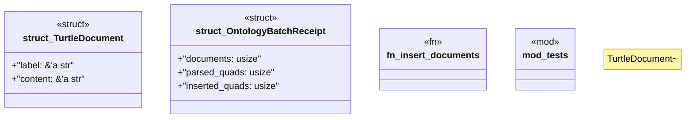

# `crates/ggen-engine/src/graph/ontology_batch.rs`

Source SHA-256: `3c4655c9e5c6302787c6fecdd51fe6f18600bf29de5d7d091f5c24a4414e4f87`

## Dependencies

- `oxigraph::{ io::{RdfFormat, RdfParser}, model::Quad, }`
- `std::{collections::HashSet, time::Instant}`
- `super::*`
- `super::{AppError, DeterministicGraph, Result}`

## Standing

- Structural parse: `ALIVE`
- Runtime behavior: `UNKNOWN`
