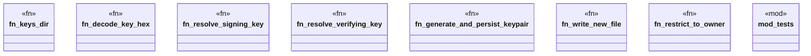

# `crates/ggen-engine/src/keys.rs`

Source SHA-256: `7c89e834c62b4e839adea107e78db13d9afb3304982cf9932155d9e61658a1a5`

## Dependencies

- `crate::error::{AppError, Result}`
- `ed25519_dalek::SigningKey`
- `std::io::Write as _`
- `std::os::unix::fs::PermissionsExt as _`
- `std::path::{Path, PathBuf}`
- `super::*`

## Standing

- Structural parse: `ALIVE`
- Runtime behavior: `UNKNOWN`
