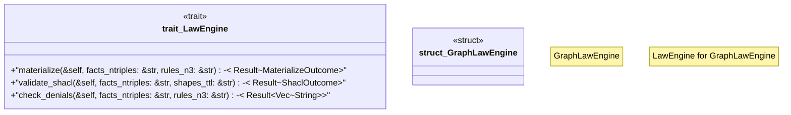

# `crates/ggen-engine/src/law_engine.rs`

Source SHA-256: `028635aa17a8eeee7d50d69568567c7c8e07b9a26a1ea64490f72d197b4269d8`

## Dependencies

- `crate::error::{AppError, Result}`
- `crate::graph::{MaterializeOutcome, ShaclOutcome}`
- `praxis_graphlaw::parser::Syntax`
- `std::collections::BTreeSet`

## Standing

- Structural parse: `ALIVE`
- Runtime behavior: `UNKNOWN`
