# `crates/ggen-engine/src/lib.rs`

Source SHA-256: `888f35e00f6b1c60e45771508f0b3e35421e6b7bfed23a77715e3bee4688be64`

```mermaid
classDiagram
    class mod_config {
      <<mod>>
    }
    class mod_error {
      <<mod>>
    }
    class mod_generation_rules {
      <<mod>>
    }
    class mod_graph {
      <<mod>>
    }
    class mod_law_engine {
      <<mod>>
    }
    class mod_lint {
      <<mod>>
    }
    class mod_keys {
      <<mod>>
    }
    class mod_pack {
      <<mod>>
    }
    class mod_project_graph {
      <<mod>>
    }
    class mod_schema_dispatch {
      <<mod>>
    }
    class mod_shell_safety {
      <<mod>>
    }
    class mod_sync {
      <<mod>>
    }
    class mod_template {
      <<mod>>
    }
    class mod_types {
      <<mod>>
    }
    class mod_write {
      <<mod>>
    }
    class mod_repl {
      <<mod>>
    }
    class mod_verbs {
      <<mod>>
    }
    class mod_watch {
      <<mod>>
    }
```

## Dependencies

- `error::AppError`
- `types::{ canonical_bytes, Admit, Admitted, AdmittedEvidence, AdmittedReceipt, Blake3Hash, Evidence, ObjectRef, ProfileId, Raw, RawEvidence, Validated, ValidatedEvidence, }`

## Standing

- Structural parse: `ALIVE`
- Runtime behavior: `UNKNOWN`
