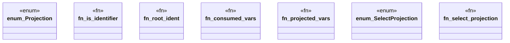

# `crates/ggen-engine/src/lint.rs`

Source SHA-256: `3ea033ea7ecc2464f828e1bba1c2afcfafa550687be6275eaa7b81f61575a140`

## Dependencies

- `crate::{ error::AppError, template::{Frontmatter, Template}, }`
- `std::{collections::BTreeSet, path::Path}`
- `super::*`

## Standing

- Structural parse: `ALIVE`
- Runtime behavior: `UNKNOWN`
