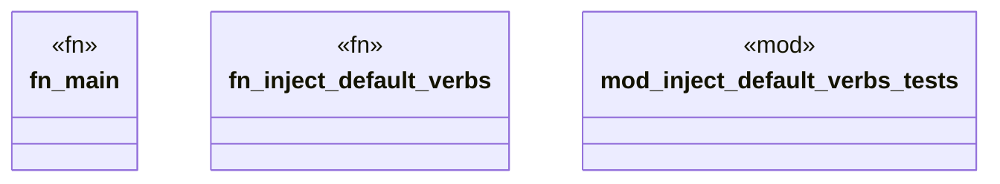

# `crates/ggen-engine/src/main.rs`

Source SHA-256: `d1b766c9bf612ff047dd67a39b96722aca4bfd027c7815ece405dd5ca1ead933`

## Dependencies

- `anyhow::Result`
- `ggen as _`
- `super::inject_default_verbs`

## Standing

- Structural parse: `ALIVE`
- Runtime behavior: `UNKNOWN`
