# `crates/ggen-engine/src/pack.rs`

Source SHA-256: `af4ea9422797b06e98d0ecb09d517d051fb54fbea6d04e88f49180185f7fda19`

```mermaid
classDiagram
    class struct_Pack {
      <<struct>>
      +"name: String"
      +"version: String"
      +"description: String"
      +"root: PathBuf"
      +"ontology_path: PathBuf"
      +"extra_ontology_paths: Vec~(String"
      +"template_paths: Vec~PathBuf~"
      +"lock: bool"
    }
    class struct_PackToml {
      <<struct>>
      +"pack: PackMeta"
    }
    class struct_PackMeta {
      <<struct>>
      +"name: String"
      +"version: String"
      +"description: String"
    }
    class fn_resolve {
      <<fn>>
    }
    class fn_resolve_git_pack_dir {
      <<fn>>
    }
    class fn_resolve_pack_dir {
      <<fn>>
    }
    class fn_content_hash {
      <<fn>>
    }
    class struct_LockEntry {
      <<struct>>
      +"name: String"
      +"source: String"
      +"content_hash: String"
    }
    class struct_LockDoc {
      <<struct>>
      +"packs: std::collections::BTreeMap~String"
    }
    class struct_LockDocEntry {
      <<struct>>
      +"source: String"
      +"content_hash: String"
    }
    class fn_source_string {
      <<fn>>
    }
    class fn_lock_entries {
      <<fn>>
    }
    class fn_check_lock {
      <<fn>>
    }
    class fn_write_lock {
      <<fn>>
    }
    class fn_rel_string {
      <<fn>>
    }
    class mod_tests {
      <<mod>>
    }
```

## Dependencies

- `crate::{ config::{GgenConfig, PackRef}, error::{AppError, Result}, }`
- `serde::Deserialize`
- `std::fmt::Write as _`
- `std::path::{Path, PathBuf}`
- `std::process::Command`
- `super::*`
- `tempfile::TempDir`

## Standing

- Structural parse: `ALIVE`
- Runtime behavior: `UNKNOWN`
