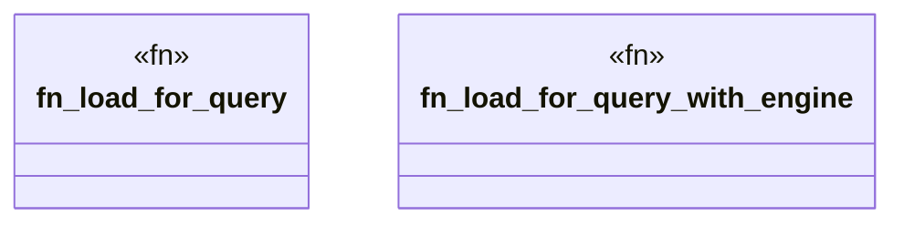

# `crates/ggen-engine/src/project_graph.rs`

Source SHA-256: `79ad518f772f2a73e350c063e99d33ea6bf065ebc38e1328b9faf425e20264b5`

## Dependencies

- `crate::error::Result`
- `crate::graph::{GraphEngine, TurtleDocument}`
- `crate::schema_dispatch::{self, ParsedGgenToml}`
- `crate::sync::{new_graph_engine, read_ontology_file, EngineKind}`
- `std::path::Path`
- `std::sync::Arc`

## Standing

- Structural parse: `ALIVE`
- Runtime behavior: `UNKNOWN`
