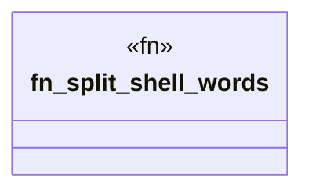

# `crates/ggen-engine/src/repl.rs`

Source SHA-256: `64096031a690c77668349911076f755548d967d9d6bd2c2c630a7287051d4a94`

## Dependencies

- None observed.

## Standing

- Structural parse: `ALIVE`
- Runtime behavior: `UNKNOWN`
