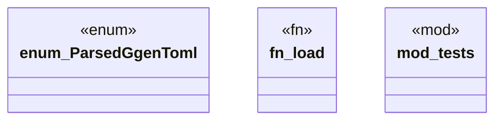

# `crates/ggen-engine/src/schema_dispatch.rs`

Source SHA-256: `b373454e5cf1f2f74ab81be367ad9e365ffda45ab83fd589b2fdbf9658d74fd4`

## Dependencies

- `crate::{ config::GgenConfig, error::{AppError, Result}, }`
- `ggen_config::{manifest::GgenManifest, ConfigSchemaClassification}`
- `std::path::Path`
- `super::*`
- `tempfile::TempDir`

## Standing

- Structural parse: `ALIVE`
- Runtime behavior: `UNKNOWN`
