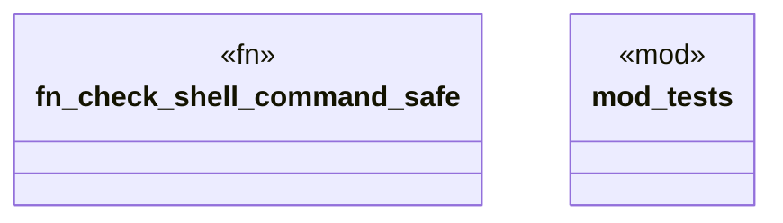

# `crates/ggen-engine/src/shell_safety.rs`

Source SHA-256: `56b1bff4d86196272d0411a9967911e76ba98993f98f8db68627c2b2d90722f4`

## Dependencies

- `crate::error::{AppError, Result}`
- `super::*`

## Standing

- Structural parse: `ALIVE`
- Runtime behavior: `UNKNOWN`
