# `crates/ggen-engine/src/sync.rs`

Source SHA-256: `52ce4de651a9186adf27f3ed381633deb3081c0bf61c70afea0b095f705f2e5a`

```mermaid
classDiagram
    class enum_EngineKind {
      <<enum>>
    }
    class fn_new_graph_engine {
      <<fn>>
    }
    class fn_read_ontology_file {
      <<fn>>
    }
    class struct_SyncOptions {
      <<struct>>
      +"dry_run: bool"
      +"engine: EngineKind"
    }
    class struct_SyncReport {
      <<struct>>
      +"written: Vec~PathBuf~"
      +"skipped: Vec~(PathBuf"
      +"graph_hash_hex: String"
      +"decisions: BTreeMap~String"
      +"packs: BTreeMap~String"
      +"closure: BTreeMap~String"
    }
    class struct_PendingWrite {
      <<struct>>
      +"to: String"
      +"body: String"
      +"frontmatter: Frontmatter"
    }
    class enum_ProjectionMode {
      <<enum>>
    }
    class struct_SyncReceipt {
      <<struct>>
      +"record: ReceiptRecord"
      +"payload: ReceiptPayload"
    }
    class struct_ReceiptPayload {
      <<struct>>
      +"graph_hash: String"
      +"outputs: BTreeMap~String"
      +"packs: BTreeMap~String"
      +"decisions: BTreeMap~String"
      +"closure: BTreeMap~String"
    }
    class fn_sync {
      <<fn>>
    }
    class struct_GateFile {
      <<struct>>
      +"message: Option~String~"
      +"query: String"
    }
    class fn_parse_gate_source {
      <<fn>>
    }
    class enum_GateOutcome {
      <<enum>>
    }
    class fn_evaluate_gate {
      <<fn>>
    }
    class fn_engine_value_display {
      <<fn>>
    }
    class fn_list_gate_files {
      <<fn>>
    }
    class fn_rel_display {
      <<fn>>
    }
    class fn_hash_file_or_missing {
      <<fn>>
    }
    class type_ExtractedRows {
      <<type>>
    }
    class fn_extract_query_results {
      <<fn>>
    }
    class fn_base_context {
      <<fn>>
    }
    class fn_row_context {
      <<fn>>
    }
    class fn_render_str {
      <<fn>>
    }
    class fn_render_optional_output_field {
      <<fn>>
    }
    class fn_render_optional_match_field {
      <<fn>>
    }
    class fn_render_output_frontmatter {
      <<fn>>
    }
    class fn_render_aggregate_projection {
      <<fn>>
    }
    class fn_context_key_summary {
      <<fn>>
    }
    class fn_value_type_name {
      <<fn>>
    }
    class fn_apply {
      <<fn>>
    }
    class fn_match_evidence_suffix {
      <<fn>>
    }
    class fn_run_shell_hook {
      <<fn>>
    }
    class fn_discover_templates {
      <<fn>>
    }
    class fn_load_templates {
      <<fn>>
    }
    class fn_parse_template_file {
      <<fn>>
    }
    class fn_admit_shape_files {
      <<fn>>
    }
    class fn_check_determinism {
      <<fn>>
    }
    class fn_collect_tmpl_paths {
      <<fn>>
    }
    class fn_declares_rdf_overlay {
      <<fn>>
    }
    class fn_build_turtle_prolog {
      <<fn>>
    }
    class fn_build_rdf_overlay {
      <<fn>>
    }
    class fn_insert_construct {
      <<fn>>
    }
    class fn_read_prev_head {
      <<fn>>
    }
    class fn_closure_equivalence_class {
      <<fn>>
    }
    class fn_compare_closure_class {
      <<fn>>
    }
    class fn_verify_check_axis {
      <<fn>>
    }
    class fn_verify_outcome_map {
      <<fn>>
    }
    class fn_compare_verify_class {
      <<fn>>
    }
    class struct_ClassProducerFact {
      <<struct>>
      +"exit: i64"
      +"identity: String"
    }
    class fn_prev_class_identity {
      <<fn>>
    }
    class fn_compare_producer_class {
      <<fn>>
    }
    class fn_write_receipt {
      <<fn>>
    }
    class fn_turtle_escape {
      <<fn>>
    }
    class fn_hex32 {
      <<fn>>
    }
    class mod_tests {
      <<mod>>
    }
    note "GateFile"
```

## Dependencies

- `crate::{ config::GgenConfig, error::{AppError, Result}, graph::{ DeterministicGraph, EngineQueryResults, EngineValue, GraphEngine, GraphLawStore, TurtleDocument, }, template::{build_tera, sparql_to_value, Frontmatter, MatchSpec, Template}, write::{ plan_write, preflight_checksum_slot, preflight_structured_matchers, validate_match_specs, WriteOutcome, MAX_OUTPUT_BYTES, }, }`
- `ed25519_dalek::Signer as _`
- `praxis_core::{ receipt_epoch::{ read_receipt_epoch, AdmissionDecision, AdmissionItem, AdmissionLedger, AndonLevel, CeilingLevel, ComponentLevels, EquivalenceMap, EquivalenceStatus, ObservedOutcome, ReceiptEpochV2, ReceiptEpochV2Builder, SCHEMA_V2, }, receipt_record::{ReceiptRecord, RECEIPT_RECORD_VERSION}, Andon, }`
- `serde::Serialize`
- `std::fmt::Write as _`
- `std::io::Write as _`
- `std::{ collections::{BTreeMap, BTreeSet}, path::{Path, PathBuf}, sync::Arc, time::Instant, }`
- `super::hash_file_or_missing`
- `tera::Value`

## Standing

- Structural parse: `ALIVE`
- Runtime behavior: `UNKNOWN`
