# `crates/ggen-engine/src/template.rs`

Source SHA-256: `68a8c9e5d760591fe5e141c06f42b9538e0f1dfde60080eb973ce760161bdafa`

```mermaid
classDiagram
    class struct_Frontmatter {
      <<struct>>
      +"to: String"
      +"sparql: BTreeMap~String"
      +"for_each: Option~String~"
      +"construct: Option~String~"
      +"inject: bool"
      +"before: Option~MatchSpec~"
      +"after: Option~MatchSpec~"
      +"at_line: Option~usize~"
      +"skip_if: Option~MatchSpec~"
      +"unless_exists: bool"
      +"force: bool"
      +"when: Option~String~"
      +"skip_empty: bool"
      +"from: Option~String~"
      +"sh_before: Option~String~"
      +"sh_after: Option~String~"
      +"backup: bool"
      +"shape: Vec~String~"
      +"determinism: Option~bool~"
      +"freeze_policy: Option~FreezePolicy~"
      +"freeze_slots_dir: Option~String~"
      +"rdf: Vec~String~"
      +"rdf_inline: Vec~String~"
      +"prefixes: BTreeMap~String"
      +"base: Option~String~"
    }
    class enum_MatchSpec {
      <<enum>>
    }
    class struct_MatchRule {
      <<struct>>
      +"pattern: String"
      +"matcher: MatchKind"
      +"scope: MatchScope"
      +"occurrence: MatchOccurrence"
      +"index: usize"
      +"case_sensitive: bool"
      +"trim: bool"
    }
    class enum_MatchKind {
      <<enum>>
    }
    class enum_MatchScope {
      <<enum>>
    }
    class enum_MatchOccurrence {
      <<enum>>
    }
    class enum_FreezePolicy {
      <<enum>>
    }
    class struct_Template {
      <<struct>>
      +"frontmatter: Frontmatter"
      +"body: String"
    }
    class fn_split_closing_delimiter {
      <<fn>>
    }
    class fn_string_or_seq {
      <<fn>>
    }
    class fn_sparql_map {
      <<fn>>
    }
    class fn_build_tera {
      <<fn>>
    }
    class fn_load_templates_glob_lenient {
      <<fn>>
    }
    class fn_collect_files_recursive {
      <<fn>>
    }
    class fn_tera_error_full_chain {
      <<fn>>
    }
    class fn_tera_error_location {
      <<fn>>
    }
    class fn_classify_tera_render_error {
      <<fn>>
    }
    class fn_classify_kind {
      <<fn>>
    }
    class fn_classify_msg {
      <<fn>>
    }
    class fn_sparql_to_value {
      <<fn>>
    }
    class fn_solutions_to_values {
      <<fn>>
    }
    class fn_engine_value_to_tera {
      <<fn>>
    }
    class fn_local_fn {
      <<fn>>
    }
    class fn_rows_or_results_arg {
      <<fn>>
    }
    class fn_sparql_first_fn {
      <<fn>>
    }
    class fn_sparql_values_fn {
      <<fn>>
    }
    class fn_sparql_empty_fn {
      <<fn>>
    }
    class fn_sparql_count_fn {
      <<fn>>
    }
    class fn_hex_to_u64_filter {
      <<fn>>
    }
    class fn_snake_case_filter {
      <<fn>>
    }
    class fn_pascal_case_filter {
      <<fn>>
    }
    class fn_split_words {
      <<fn>>
    }
    class fn_camel_case_filter {
      <<fn>>
    }
    class fn_kebab_case_filter {
      <<fn>>
    }
    class fn_shouty_snake_case_filter {
      <<fn>>
    }
    class fn_title_case_filter {
      <<fn>>
    }
    class fn_pluralize_filter {
      <<fn>>
    }
    class fn_pluralize_word {
      <<fn>>
    }
    class fn_singularize_filter {
      <<fn>>
    }
    class mod_tests {
      <<mod>>
    }
    note "From~"
    note "From~String~ for MatchSpec"
    note "MatchSpec"
    note "Template"
```

## Dependencies

- `crate::{ error::{AppError, Result, TemplateFailureCause}, graph::{EngineQueryResults, EngineRow, EngineValue, GraphEngine}, }`
- `schemars::JsonSchema`
- `serde::Deserialize`
- `serde::de::{Error as DeError, SeqAccess, Visitor}`
- `std::error::Error as StdError`
- `std::fmt`
- `std::{ collections::{BTreeMap, HashMap}, path::{Path, PathBuf}, sync::Arc, }`
- `super::*`
- `tera::{Tera, Value}`

## Standing

- Structural parse: `ALIVE`
- Runtime behavior: `UNKNOWN`
