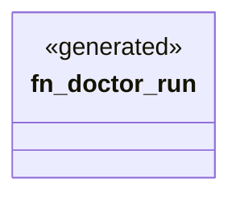

# `crates/ggen-engine/src/verbs/doctor.rs`

Source SHA-256: `93112b5a23928103473357cd9c2c2114dc224b89b6bdaca46cc19b273da65bb0`

## Dependencies

- `clap_noun_verb::Result`

## Standing

- Structural parse: `ALIVE`
- Runtime behavior: `UNKNOWN`
