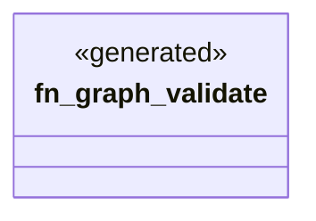

# `crates/ggen-engine/src/verbs/graph.rs`

Source SHA-256: `7563343e140107fcb64e74b77096b938b0c2b33bcde8ea366895867c28dd4b27`

## Dependencies

- `clap_noun_verb::Result`

## Standing

- Structural parse: `ALIVE`
- Runtime behavior: `UNKNOWN`
