# `crates/ggen-engine/src/verbs/handlers.rs`

Source SHA-256: `b0a1b48fc0ad570bdd9000238471d453b9708ab1ab169a57ad3f9a1bdae3334d`

```mermaid
classDiagram
    class fn_project_root {
      <<fn>>
    }
    class fn_exec_err {
      <<fn>>
    }
    class struct_RawPayloadProbe {
      <<struct>>
      +"payload: &'a serde_json::value::RawValue"
    }
    class fn_stored_payload_hash {
      <<fn>>
    }
    class fn_handle_sync_run {
      <<fn>>
    }
    class fn_handle_graph_validate {
      <<fn>>
    }
    class fn_graph_validate_frontmatter {
      <<fn>>
    }
    class fn_graph_validate_declarative_rules {
      <<fn>>
    }
    class fn_validate_files {
      <<fn>>
    }
    class fn_handle_receipt_verify {
      <<fn>>
    }
    class fn_handle_receipt_history {
      <<fn>>
    }
    class fn_templated_to_matches {
      <<fn>>
    }
    class fn_orphaned_artifacts_check {
      <<fn>>
    }
    class fn_handle_doctor {
      <<fn>>
    }
    class fn_build_law_engine {
      <<fn>>
    }
    class fn_handle_law_load {
      <<fn>>
    }
    class fn_handle_law_validate {
      <<fn>>
    }
    class fn_handle_law_derive {
      <<fn>>
    }
    class fn_handle_law_explain {
      <<fn>>
    }
    class fn_handle_law_export {
      <<fn>>
    }
```

## Dependencies

- `camino::Utf8PathBuf`
- `clap_noun_verb::{NounVerbError, Result}`
- `crate::config::GgenConfig`
- `crate::error::AppError`
- `crate::graph::GraphEngine as _`
- `crate::graph::{DeterministicGraph, GraphEngine, TurtleDocument}`
- `crate::graph::{GraphEngine as _, GraphLawStore}`
- `crate::sync::{sync, SyncOptions, SyncReceipt, RECEIPT_LOG_REL_PATH, RECEIPT_REL_PATH}`
- `ed25519_dalek::Verifier as _`
- `std::path::PathBuf`

## Standing

- Structural parse: `ALIVE`
- Runtime behavior: `UNKNOWN`
