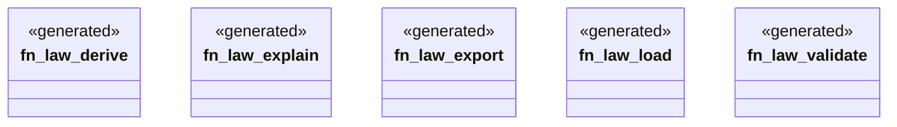

# `crates/ggen-engine/src/verbs/law.rs`

Source SHA-256: `6007a706d063ca8eed121ae762530f4b64fd0153df16cea1704ff575183f06a6`

## Dependencies

- `clap_noun_verb::Result`

## Standing

- Structural parse: `ALIVE`
- Runtime behavior: `UNKNOWN`
