# `crates/ggen-engine/src/verbs/mod.rs`

Source SHA-256: `3f4233a6cd4ed343cea99cf7ed9c0936e9057e00f0f13227deacb502d8fe5716`

```mermaid
classDiagram
    class mod_handlers {
      <<generated>>
    }
    class mod_doctor {
      <<generated>>
    }
    class mod_graph {
      <<generated>>
    }
    class mod_law {
      <<generated>>
    }
    class mod_receipt {
      <<generated>>
    }
    class mod_sync {
      <<generated>>
    }
    class fn_register_doctor_noun {
      <<generated>>
    }
    class fn_register_graph_noun {
      <<generated>>
    }
    class fn_register_law_noun {
      <<generated>>
    }
    class fn_register_receipt_noun {
      <<generated>>
    }
    class fn_register_sync_noun {
      <<generated>>
    }
```

## Dependencies

- None observed.

## Standing

- Structural parse: `ALIVE`
- Runtime behavior: `UNKNOWN`
