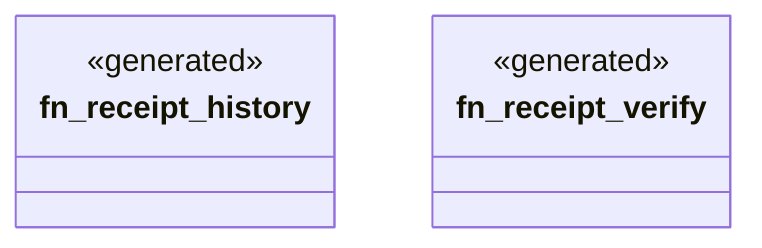

# `crates/ggen-engine/src/verbs/receipt.rs`

Source SHA-256: `41e32f749c6cafbeb78850a512fd4bb7da89ed265c61db85517658c511b7403c`

## Dependencies

- `clap_noun_verb::Result`

## Standing

- Structural parse: `ALIVE`
- Runtime behavior: `UNKNOWN`
