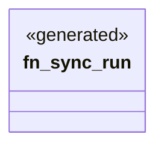

# `crates/ggen-engine/src/verbs/sync.rs`

Source SHA-256: `faf9ae6d5c8206ae595564c3408d6f9b493b21b2e1d262006ae82d3864324c51`

## Dependencies

- `clap_noun_verb::Result`

## Standing

- Structural parse: `ALIVE`
- Runtime behavior: `UNKNOWN`
