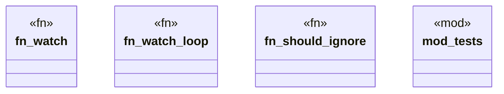

# `crates/ggen-engine/src/watch.rs`

Source SHA-256: `75f4f8d7f4e08be3b50d0b9b714747f292df6bcdc62a1f96c9c1c11944e165e8`

## Dependencies

- `crate::{ error::{AppError, Result}, sync::{sync, SyncOptions, SyncReport}, }`
- `notify::RecursiveMode`
- `notify_debouncer_full::new_debouncer`
- `std::{ path::{Path, PathBuf}, sync::mpsc, time::Duration, }`
- `std::{ sync::mpsc::{RecvTimeoutError, Sender}, thread, }`
- `super::*`
- `tempfile::TempDir`

## Standing

- Structural parse: `ALIVE`
- Runtime behavior: `UNKNOWN`
