# `crates/ggen-engine/tests/book_gap_closure_e2e.rs`

Source SHA-256: `ae244c1736141b67a8f332b6359d4f9b64770b083550aea43c2cd1e7ba7289d4`

```mermaid
classDiagram
    class fn_packs_dir {
      <<fn>>
    }
    class fn_copy_tree {
      <<fn>>
    }
    class fn_tree_digest {
      <<fn>>
    }
    class fn_assert_cli_success {
      <<fn>>
    }
    class fn_scaffold_gap_pack_consumer {
      <<fn>>
    }
    class fn_five_gap_packs_resolve_compose_receipt_and_replay_idempotently {
      <<fn>>
    }
    class fn_run_cargo_test {
      <<fn>>
    }
    class fn_mfw_pcp_certificate_inventory_evolves_from_ontology_without_hand_repair {
      <<fn>>
    }
```

## Dependencies

- `chicago_tdd_tools::cli_proof::CliHarness`
- `std::path::{Path, PathBuf}`
- `std::process::Command`
- `tempfile::TempDir`

## Standing

- Structural parse: `ALIVE`
- Runtime behavior: `UNKNOWN`
